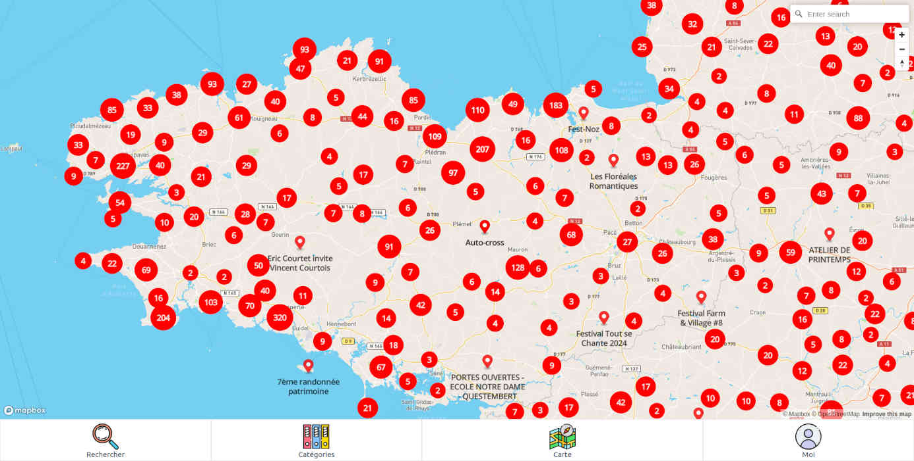
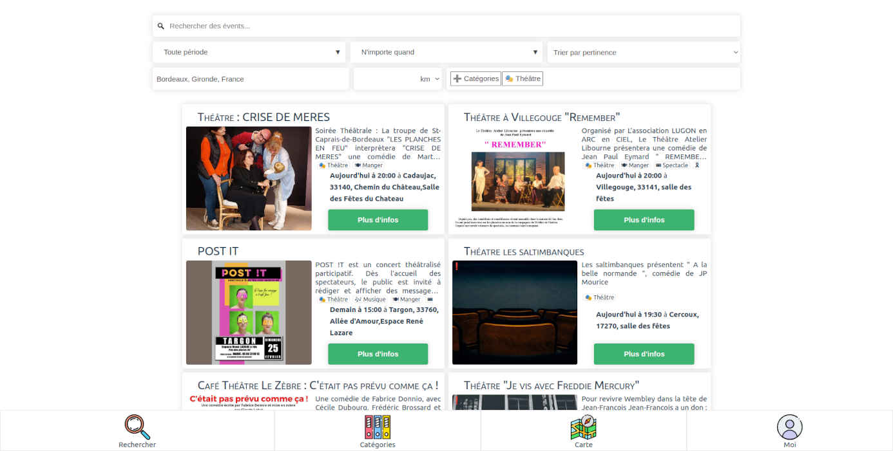

# Évents 🗺

Ceci est un site web permettant aux utilisateurs de rechercher des événements autour d'eux ou d'en ajouter.




Une version est actuellement à cette URL : [ambi.dev/events](https://ambi.dev/events). (BDD MariaDB, PHP 8) La branche master y est auto-déployer à chaque push.

## Lancer en local

Il est possible de lancer le projet en local.
Pour cela il faut faudra PHP, MySQL (ou MariaDB) et nodeJS.
 - cloner le projet
 - créer un fichier `api/credentials.php` contenant identifiants de la base de données, sous cette forme :
```php
<?php
define('EVENTS_DB_HOSTNAME', 'localhost');
define('EVENTS_DB_USER', 'user');
define('EVENTS_DB_PASSWORD', 'password123');
define('EVENTS_DB_NAME', 'events');

define('EVENTS_CONNECT_URL', 'http://localhost/connect.php?app=events&params=');
define('EVENTS_TESTUSER_URL', 'http://localhost/api/user.php?token=');

define("SEATGEEK_CLIENT_ID", "PutY0urCl1eNtIdH3r3xxxxxxx");
define("SEATGEEK_CLIENT_SECRET", "puty0urcli3nt1dh3r3xxxxxxxxxxxxxxxxxxxxxxxxxxxxxxxxxxxxxxxxxxxxx");

define("TICKETMASTER_API_KEY", "PutYourApiKeyHerexxxxxxxxxxxxxxx");
?>
```
 -
       npm install
       npm run build

 - exécuter dans la base de données le script SQL [init.sql](init.sql)
 - lancer le serveur php dans le dossier `dist`
