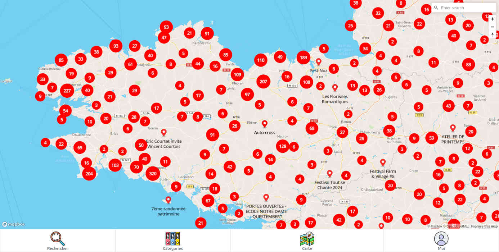
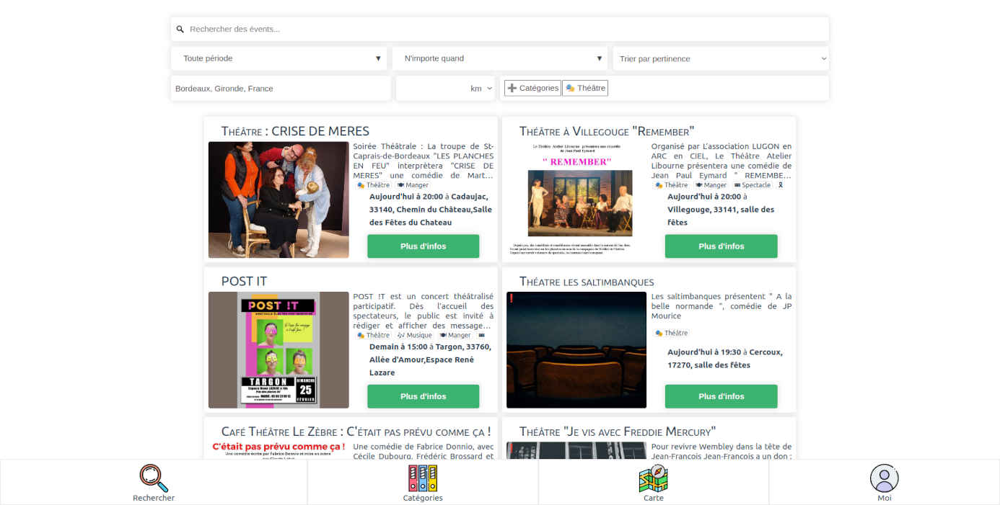

# Évents 🗺

Ceci est un site web permettant aux utilisateurs de rechercher des événements autour d'eux ou d'en ajouter.




Une version est actuellement à cette URL : [ambi.dev/events](https://ambi.dev/events). (BDD MariaDB, PHP 8)

La branche master y est auto-déployer à chaque push.


## Lancer en local 🚀

Il est possible de lancer le projet en local.

 - cloner le projet

### Soit avec Docker (recommandé) 🐳
> Pour cela il faudra Docker et Docker Compose.

 - définir les variables d'environnement `PORTAL_CONNECT_URL`, `PORTAL_USER_URL` et éventuellement `SEATGEEK_CLIENT_ID`, `SEATGEEK_CLIENT_SECRET` et `TICKETMASTER_API_KEY`. Cela peut se faire dans un fichier `.env` à la racine du projet.
 - lancer le projet avec docker-compose : `docker-compose up -d`

### Soit sans Docker 🐢

> Pour cela il faut faudra PHP, MySQL (ou MariaDB) et NodeJS.

 - créer un fichier `api/src/credentials.php` contenant identifiants de la base de données, sous cette forme :
```php
<?php
define('DB_HOST', 'localhost');
define('DB_USER', 'user');
define('DB_PASS', 'password123');
define('DB_NAME', 'events');
define('PORTAL_CONNECT_URL', 'http://localhost/connect.php?app=events&params=');
define('PORTAL_USER_URL', 'http://localhost/api/user.php?token=');
// les lignes suivantes sont optionnelles
define("SEATGEEK_CLIENT_ID", "PutY0urCl1eNtIdH3r3xxxxxxx");
define("SEATGEEK_CLIENT_SECRET", "puty0urcli3nt1dh3r3xxxxxxxxxxxxxxxxxxxxxxxxxxxxxxxxxxxxxxxxxxxxx");
define("TICKETMASTER_API_KEY", "PutYourApiKeyHerexxxxxxxxxxxxxxx");
?>
```
 - installer les dépendances et compiler le front-end :
```bash
cd front
npm install
npm run build
```
 - exécuter dans la base de données le script SQL [init.sql](init.sql)
 - lancer le serveur php dans le dossier `dist`
